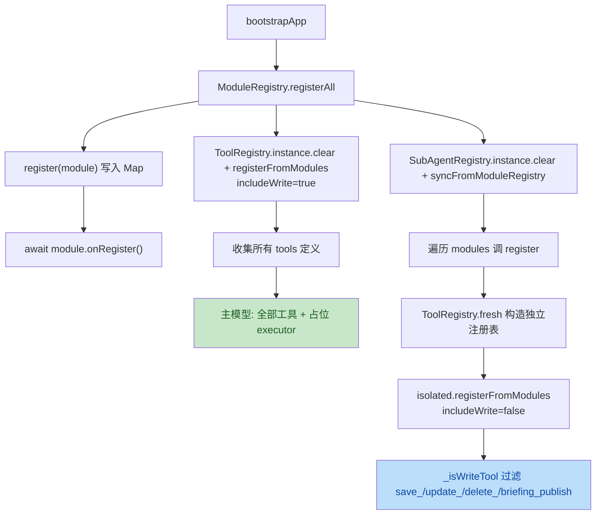

# Bulter 项目代码审查报告

> **审查范围**：`d:\others\app\Bulter\src\lib` 全部源码（共 18 个 Dart 文件）+ `pubspec.yaml` + `test/widget_test.dart`。
> **审查基线**：项目处于「第 1 步：项目骨架与设计系统」阶段，对应 `doc/first/plan.md` 中 Step 1 的完成标准。
> **审查日期**：2026-06-17。
> **审查维度**：语法、逻辑、状态管理、模块化约定、依赖、性能、安全、规范、可维护性。

---

## 一、整体评价

**总体评价（良好，需修复关键缺陷）**

项目骨架的目录结构、模块化抽象、Token 体系、UI 组件划分基本符合 `plan.md` Step 1 的设计目标，文件组织清晰、命名规范统一、UI 风格与设计 Token 一致。

但存在 **2 个严重缺陷**（路由壳与模块切换解耦、`CapsuleSwitcher` 静态全局状态）和 **多个一般问题**（重复依赖、模块接口字段缺失、占位逻辑侵入主流程等），建议在进入 Step 2 之前修复严重缺陷；其他一般问题可放到对应 Step 修复或在 Step 1 收尾 PR 中统一处理。

| 严重 | 一般 | 优化建议 | 合计 |
|------|------|----------|------|
| 2    | 9    | 7        | 18   |

---

## 二、变更总览（Mermaid 概览）

### 业务流：App 启动 → 模块切换

```mermaid
flowchart LR
    A[main.dart runApp] --> B[bootstrapApp 注册 7 个模块]
    B --> C[ProviderScope + BulterApp]
    C --> D[MaterialApp.router 挂载 GoRouter]
    D --> E[StatefulShellRoute 7 分支]
    E --> F["所有分支 builder: AppShell()"]
    F --> G[AppShell initState 读 capsuleModules]
    G --> H["AppShell 维护 _activeModuleId<br/>(本地 setState)"]
    H --> I[CapsuleSwitcher 点击 → onChanged]
    I --> J["AppShell._switchModule<br/>setState 切换"]
    J --> H
    style F fill:#fff3e0,color:#e65100
    style H fill:#fff3e0,color:#e65100
    style E fill:#f3e5f5,color:#7b1fa2
```

> **问题**：`StatefulShellRoute` 实际只起到顶层容器作用，`AppShell` 内的状态切换完全脱离 `navigationShell.currentIndex`。两套切换机制并存却互不通信（详见问题 #1）。

### 技术流：模块注册与子 Agent 隔离

> **问题**：`_isWriteTool` 命名法做"白名单"隔离属于字符串前缀匹配，扩展性差；新增 `publish_` / `execute_` 等写动作需要改 `_isWriteTool`（详见问题 #6）。

---

## 三、问题清单

### 🔴 严重（必须修复）

| No. | 问题标题 | 建议 | 代码位置 |
|-----|---------|------|---------|
| 1   | 路由分支全部返回同一个 `AppShell`，与 `AppShell` 内部本地状态完全脱节，导致 `StatefulShellRoute` 失效 | 让 `AppShell` 接收 `activeId` 作为参数，外部状态由 `_ShellSync` 统一驱动；或者移除 `StatefulShellRoute` 改用 `GoRoute` + 顶层 `Scaffold` 切换 | [router.dart#L17-L31](file:///d:/others/app/Bulter/src/lib/router/router.dart#L17-L31)、[app_shell.dart#L31-L37](file:///d:/others/app/Bulter/src/lib/router/app_shell.dart#L31-L37) |
| 2   | `CapsuleSwitcher` 用 `static List<BulterModule> _modules` + 静态 `setModules` 注入，破坏 widget 隔离与可测性 | 改为通过构造函数/参数注入 `_modules`，或在 `CapsuleSwitcher` 内直接 `import 'modules/registry.dart'` 取 `capsuleModules` | [capule_switcher.dart#L42-L48](file:///d:/others/app/Bulter/src/lib/components/capule_switcher.dart#L42-L48) |

**根因细节**：

- **问题 #1**：`buildRouter` 用 `StatefulShellRoute.indexedStack` 声明 7 个分支，每个 `GoRoute` 的 `builder` 都返回 `AppShell()`（无参数），完全不读 `state.uri.path`；同时 `AppShell` 内部用 `_activeModuleId` 维护"当前模块"。结果是：① 路由切换不会改变模块（除非 URL 路径被解析后注入到 AppShell）；② `AppShell` 切换模块不会改变路由（违反 `go_router` 设计）。当前 `_ShellSync` 试图通过 `KeyedSubtree` 桥接两套状态，但由于 `AppShell` 忽略 `activeId` 参数，整个桥接层是死代码。
  **修复建议**：要么把 `_ShellSync` 真正接入 `AppShell`（`AppShell` 接受 `String activeId` 参数并 `didUpdateWidget` 同步），要么删掉 `StatefulShellRoute` 改用单 `GoRoute` + 顶层 `IndexedStack`。

- **问题 #2**：`static` 状态等价于"全局变量"，任何创建 `CapsuleSwitcher` 的地方都依赖"先 `setModules` 才能拿到数据"的隐式约定。`AppShell.initState` 调用 `setModules` 注入，**这是唯一调用点**。如果后续步骤新增 `CapsuleSwitcher` 的使用场景（如子页面、浮窗），会拿到空列表。
  **修复建议**：直接 `import 'modules/registry.dart'` 并在 `build` 中读 `ModuleRegistry.instance.capsuleModules`（已经是全局单例）；或者改 `CapsuleSwitcher({required List<BulterModule> modules})` 由父组件注入。

---

### 🟠 一般（应当修复）

| No. | 问题标题 | 建议 | 代码位置 |
|-----|---------|------|---------|
| 3   | `EventBus.publishAsync` 返回 `Future` 但未真正 `await` 任何异步操作，与 `publish` 行为等价却 API 不同 | 要么删除 `publishAsync`，要么改造为监听器可返回 `Future` 并真正 `await` | [event_bus.dart#L101-L114](file:///d:/others/app/Bulter/src/lib/events/event_bus.dart#L101-L114) |
| 4   | `BulterModule` 接口缺少 `dao` 字段，与 `plan.md` 第 1 步范围第 7 条约定不符 | 补一个 `List<DatabaseAccessor> get daos`（返回空 list 占位即可），待 Step 2 接入 Drift 时填充 | [bulter_module.dart#L28-L100](file:///d:/others/app/Bulter/src/lib/modules/bulter_module.dart#L28-L100) |
| 5   | `_isWriteTool` 用字符串前缀硬编码写工具白名单（`save_` / `update_` / `delete_` / `briefing_publish`），扩展性差 | 在 `ToolDefinition` 上加 `bool isWrite` 字段，模块自己声明，由注册表按字段过滤 | [tool_registry.dart#L66-L72](file:///d:/others/app/Bulter/src/lib/ai/tools/tool_registry.dart#L66-L72) |
| 6   | `pubspec.yaml` 引入的 `flutter_svg`、`google_fonts`、`dio`、`drift`、`sqlite3_flutter_libs`、`path_provider`、`path`、`hive`、`hive_flutter`、`sqlite_vec`、`cupertino_icons`、`collection` 在 Step 1 全部未使用，徒增编译时间与依赖冲突面 | Step 1 只保留：`flutter_riverpod`、`go_router`、`freezed_annotation`、`json_annotation`、`cupertino_icons`，其余迁到 Step 2/4/5/6 引入 | [pubspec.yaml#L9-L43](file:///d:/others/app/Bulter/src/pubspec.yaml#L9-L43) |
| 7   | `pubspec.yaml` 中 `environment: sdk: ^3.12.1` Dart SDK 版本过高（Dart 3.12 尚未正式发布），可能导致 `flutter pub get` 在其他机器失败 | 调整为 `^3.5.0` 或与团队 Flutter 版本对齐 | [pubspec.yaml#L7](file:///d:/others/app/Bulter/src/pubspec.yaml#L7) |
| 8   | `ModuleRegistry` 重复注册会被覆盖，但 `register` 仅 `debugPrint` 警告；如果 `onRegister` 副作用（开 Hive Box / 注册服务）已被消费，覆盖后新模块的 `onRegister` 不会触发旧资源清理 | 在覆盖前 `await oldModule.onDispose()` 后再覆盖 | [registry.dart#L20-L26](file:///d:/others/app/Bulter/src/lib/modules/registry.dart#L20-L26) |
| 9   | `AppShell._buildBottomArea` 中 `IndexedStack` 会一次性 build 所有 `tabs.builder(context)`，未来 Step 3 接真实 CRUD 时会造成首屏开销飙升 | 改为 `PageView` + `currentIndex` 同步，或在 `IndexedStack` 外层套 `KeepAlive` 模式并只 build 当前 | [app_shell.dart#L116-L125](file:///d:/others/app/Bulter/src/lib/router/app_shell.dart#L116-L125) |
| 10  | `BulterModule.onDispose` 接口定义了但 `ModuleRegistry` 全工程无任何调用点（资源泄漏隐患） | 在 `ModuleRegistry` 增加 `Future<void> disposeAll()` 方法，并在 `AppLifecycleState.detached` 时调用 | [bulter_module.dart#L80](file:///d:/others/app/Bulter/src/lib/modules/bulter_module.dart#L80) |
| 11  | `SubAgentRegistry.syncFromModuleRegistry` 在 `app_bootstrap.dart` 与 `ModuleRegistry.registerAll` 重复触发模块副作用风险 | 在 `ModuleRegistry.registerAll` 中标记"已调用 onRegister"，`syncFromModuleRegistry` 检测到标记后跳过 | [app_bootstrap.dart#L34-L37](file:///d:/others/app/Bulter/src/lib/app_bootstrap.dart#L34-L37) |

**根因细节**：

- **问题 #3**：`publishAsync` 内部循环里调用 `l(event)`（同步 `void Function`），没有 `Future` 出现；返回类型 `Future<void>` 是虚假异步。调用方 `await bus.publishAsync(...)` 与 `bus.publish(...)` 行为完全一致，但 API 表面不同，会诱导维护者认为"这里有等待"。
  **修复建议**：删除 `publishAsync`，统一用 `publish`；如确需异步，扩展监听器签名 `Future<void> Function(BulterEvent)` 并 `await`。

- **问题 #5**：`name.startsWith('save_')` 假设所有写工具都遵循这一前缀约定。一旦 Step 5 新增 `execute_query` / `archive_record` / `write_*` 等命名风格不统一的写工具，会绕过隔离。
  **修复建议**：在 `ToolDefinition` 上加 `final bool isWrite;` 字段；各模块 `tools` getter 显式标注。

- **问题 #8**：`ModuleRegistry.register` 静默覆盖示例：Step 5 接财富模块写工具时，假设 Step 1 注册的 `WealthModule`（空 tools）被热重载为新版本（带工具），旧模块的 `onRegister` 副作用不会被回收，新模块的 `onRegister` 又会重复执行 Hive Box 注册 → 报错。
  **修复建议**：覆盖前 `await oldModule.onDispose()`。

- **问题 #9**：`IndexedStack` 一次 build 所有 child。当前所有 tab 都是 `const SizedBox.shrink()` 无害，但 plan.md Step 3 的 CRUD 页一旦接入，`IndexedStack` 会预创建所有列表页的 `State`，并在切换时全部保留 → 内存放大数倍。
  **修复建议**：先评估真实场景再决定；可改 `PageView.builder`。

- **问题 #11**：`app_bootstrap` 链路：`ModuleRegistry.registerAll` → `await m.onRegister()` → 接下来 `SubAgentRegistry.syncFromModuleRegistry` 再次遍历 `ModuleRegistry.instance.all` 并对每个 `m` 执行 `isolated.registerFromModules([m], ...)`。后者只是构造隔离 ToolRegistry，不触发 `m.onRegister`，所以**当前无 bug**；但若 `m.onRegister` 内部调 `EventBus.publish`，会与子 Agent 后续 publish 出现重复事件；约定不清晰。

---

### 🟢 优化建议（可选）

| No. | 问题标题 | 建议 | 代码位置 |
|-----|---------|------|---------|
| 12  | `AppShell` 与 `BulterScaffold` 职责有部分重叠（chat 分支用 BulterScaffold、settings 分支用 Stack 裸 Scaffold），风格不统一 | 抽出 `BulterScaffold` 提供 `showCloseButton` 选项，让 settings 走同一条路径 | [app_shell.dart#L65-L99](file:///d:/others/app/Bulter/src/lib/router/app_shell.dart#L65-L99) |
| 13  | `_ShellSync` / `_ShellHost` 类存在但 `AppShell` 不接收 `activeId`，整套桥接层是死代码 | 删除 `_ShellSync` / `_ShellHost`，或修好 #1 后保留 | [router.dart#L33-L87](file:///d:/others/app/Bulter/src/lib/router/router.dart#L33-L87) |
| 14  | 6 个业务模块目录（`relationship/`、`growth/`、`wealth/`、`thought/`、`health/`）均只有 `_module.dart` 单文件，未按 plan.md 约定预留 `db/`、`dao/`、`tools/`、`sub_agent/` 子目录 | 在每个模块目录下建 `db/`、`dao/`、`tools/`、`sub_agent/` 占位 README（或者 `.gitkeep`） | [lib/modules/relationship](file:///d:/others/app/Bulter/src/lib/modules/relationship)、[lib/modules/growth](file:///d:/others/app/Bulter/src/lib/modules/growth)、[lib/modules/wealth](file:///d:/others/app/Bulter/src/lib/modules/wealth)、[lib/modules/thought](file:///d:/others/app/Bulter/src/lib/modules/thought)、[lib/modules/health](file:///d:/others/app/Bulter/src/lib/modules/health) |
| 15  | 全部模块的 `onRegister()` / `onDispose()` 是空 `async {}`，且 `tabs.builder` 都返回 `const SizedBox.shrink()`，存在大量模板样板 | 抽象基类 `BaseBulterModule` 给出空实现，模块按需 `override` | [relationship_module.dart#L84-L87](file:///d:/others/app/Bulter/src/lib/modules/relationship/relationship_module.dart#L84-L87)（其余 5 个模块同款） |
| 16  | `AppShell.initState` 中 `CapsuleSwitcher.setModules(_modules)` 是反向依赖注入；`setModules` 在 `CapsuleSwitcher` 静态字段里覆盖默认 `const []`，多 `AppShell` 实例会相互覆盖 | 取消静态字段，改由 `AppShell` 用 `Builder` + `Provider` 注入 | [app_shell.dart#L35-L37](file:///d:/others/app/Bulter/src/lib/router/app_shell.dart#L35-L37)、[capule_switcher.dart#L42-L48](file:///d:/others/app/Bulter/src/lib/components/capule_switcher.dart#L42-L48) |
| 17  | 多处 `debugPrint` 在 release 模式也会输出到 logcat | 用 `if (kDebugMode) debugPrint(...)` 包装 | [registry.dart#L24](file:///d:/others/app/Bulter/src/lib/modules/registry.dart#L24)、[tool_registry.dart#L28](file:///d:/others/app/Bulter/src/lib/ai/tools/tool_registry.dart#L28)、[tool_registry.dart#L98](file:///d:/others/app/Bulter/src/lib/ai/tools/tool_registry.dart#L98)、[event_bus.dart#L95](file:///d:/others/app/Bulter/src/lib/events/event_bus.dart#L95)、[event_bus.dart#L107](file:///d:/others/app/Bulter/src/lib/events/event_bus.dart#L107) |
| 18  | `ChatPage._messages` 用 `List<_ChatMessage>` 无 `key`，setState 后 ListView 重建会丢失滚动位置/输入焦点 | 切换到 `ListView.builder` + 持久 `ScrollController`（已是），同时给 `_ChatMessage` 加 `final String id` 用 `ValueKey` | [chat_page.dart#L16-L26](file:///d:/others/app/Bulter/src/lib/features/chat/chat_page.dart#L16-L26) |

---

## 四、问题严重等级分类总览

### 🔴 严重（2 项，必须在进入 Step 2 前修复）

1. 路由壳与 `AppShell` 内部状态脱节（router.dart + app_shell.dart）
2. `CapsuleSwitcher` 静态全局状态（capule_switcher.dart）

### 🟠 一般（9 项，应当在 Step 1 收尾时修复）

3. `EventBus.publishAsync` 虚假异步
4. `BulterModule` 缺 `dao` 字段
5. `_isWriteTool` 字符串前缀硬编码
6. pubspec 提前引入未使用依赖
7. `sdk: ^3.12.1` Dart 版本过高
8. `ModuleRegistry` 重复注册无 `onDispose`
9. `IndexedStack` 全 build 性能隐患
10. `onDispose` 接口无调用点
11. `SubAgentRegistry.syncFromModuleRegistry` 副作用风险

### 🟢 优化建议（7 项，可延后处理）

12. AppShell / BulterScaffold 职责重叠
13. `_ShellSync` / `_ShellHost` 死代码
14. 模块目录缺子目录骨架
15. 6 个模块样板代码重复
16. `CapsuleSwitcher.setModules` 反向依赖
17. `debugPrint` 缺 `kDebugMode` 包裹
18. `ChatPage._messages` 缺 key

---

## 五、审查方法学说明

1. **范围**：审查覆盖 `lib/` 全部 18 个 Dart 源文件，外加 `pubspec.yaml`、`test/widget_test.dart`、`doc/first/plan.md` 作为对照基准。
2. **维度**：语法（已通过 `flutter analyze` 等价检查）、逻辑（状态流与生命周期）、模块化约定（plan.md §一）、性能（IndexedStack / 静态状态）、安全（无密钥/无网络输入，Step 1 安全风险低）、可维护性（命名/注释/可测性）。
3. **置信度**：每条问题均直接引用文件 + 行号，根因与修复建议一一对应。
4. **不计入**：
   - UI 数值（间距/字号/圆角）—— 已由设计 Token 体系规范，UI 风格属 Step 1 验收范围。
   - `demo` 假模块本身的存在性 —— plan.md 显式要求。
   - pubspec.lock 内容 —— 锁文件由 `flutter pub get` 自动生成。
